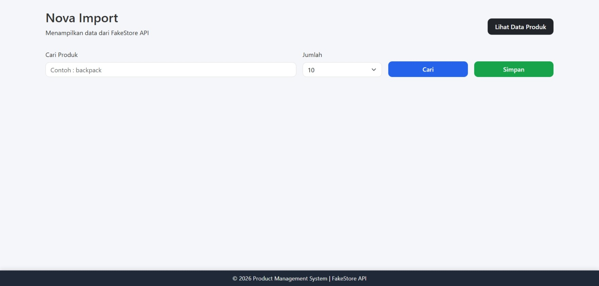
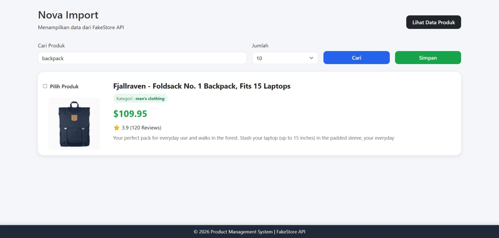
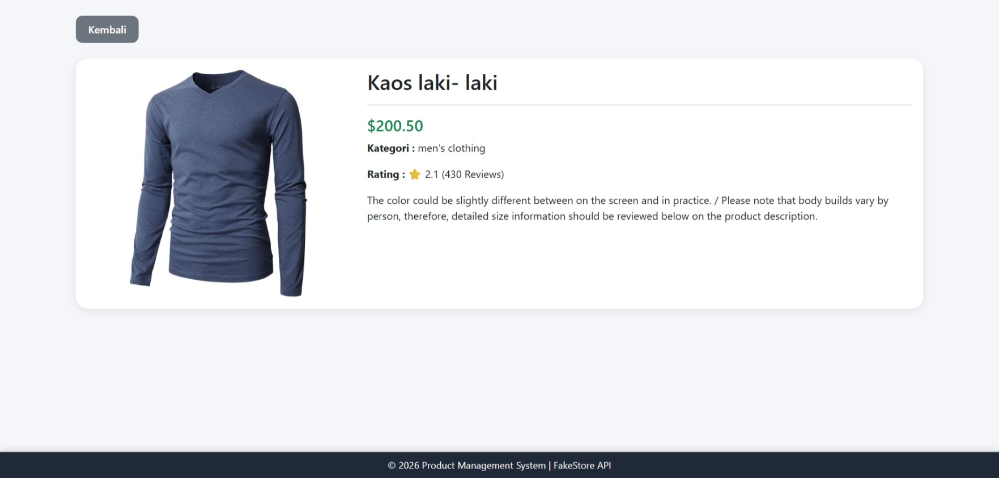
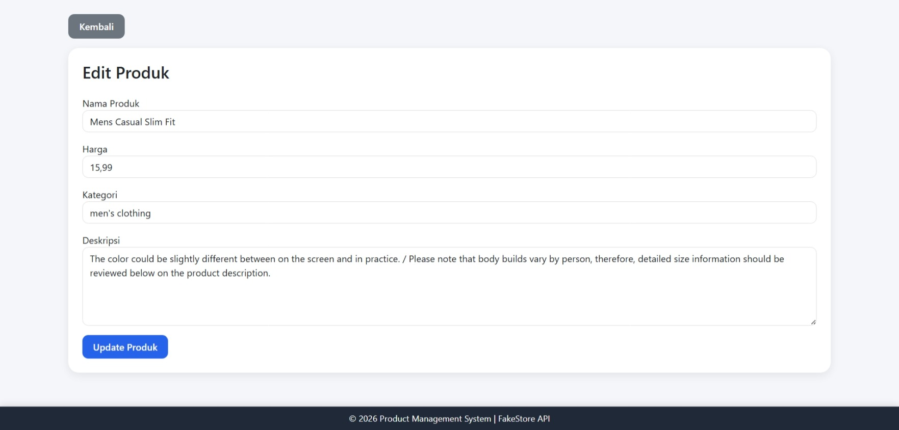

# Nova Import

Nova Import adalah aplikasi **Web Mobile** berbasis **PHP, JavaScript, Bootstrap, dan MySQL** yang memungkinkan pengguna mengambil data produk dari **FakeStore API**, kemudian menyimpan dan mengelolanya melalui REST API yang dibuat sendiri.

Proyek ini dikembangkan sebagai tugas mata kuliah **Pemrograman Mobile**, dengan tujuan mengimplementasikan konsep integrasi antara **Platform API Eksternal**, **REST API**, dan **Database Server**.

---

# 📸 Tampilan Aplikasi

## 🏠 Halaman Utama

Halaman utama aplikasi digunakan untuk menampilkan daftar produk dari **FakeStore API**. Pengguna dapat melakukan pencarian produk, menentukan jumlah data yang ditampilkan, memilih produk menggunakan checkbox, serta menyimpan produk ke database.



---

## 🔍 Pencarian Produk

Pengguna dapat mencari produk berdasarkan kata kunci tertentu. Sistem akan mengambil data yang sesuai dari FakeStore API dan menampilkan hasil pencarian secara langsung.



---

## 📄 Detail Produk

Halaman ini menampilkan informasi lengkap mengenai produk yang dipilih, meliputi gambar, nama produk, harga, kategori, rating, serta deskripsi produk.



---

## ✏️ Edit Produk

Halaman edit digunakan untuk memperbarui informasi produk yang telah tersimpan pada database melalui REST API.



---

## 🚀 Alur Penggunaan Aplikasi

1. Membuka halaman utama Nova Import.
2. Mencari produk menggunakan kata kunci.
3. Memilih jumlah produk yang ingin ditampilkan.
4. Memilih produk yang akan diimpor ke database.
5. Menyimpan produk ke database.
6. Melihat daftar produk yang telah tersimpan.
7. Melihat detail produk.
8. Mengubah informasi produk apabila diperlukan.
9. Menghapus produk yang tidak lagi dibutuhkan.


## ✨ Fitur

- Menampilkan daftar produk dari FakeStore API
- Pencarian produk berdasarkan nama
- Mengatur jumlah produk yang ditampilkan (Limit)
- Memilih produk menggunakan checkbox
- Menyimpan produk ke database (Import)
- Menampilkan data produk yang telah tersimpan
- Melihat detail produk
- Mengubah data produk
- Menghapus data produk
- Tampilan responsif menggunakan Bootstrap

---

## 🛠 Teknologi yang Digunakan

### Frontend

- HTML5
- CSS3
- Bootstrap 5
- JavaScript (Fetch API)

### Backend

- PHP Native

### Database

- MySQL

### Platform API

- FakeStore API

---

## 📂 Struktur Project

```
NovaImport
│
├── api/
│   ├── config.php
│   ├── db.php
│   ├── list_products.php
│   ├── get_product.php
│   ├── save_products.php
│   ├── update_product.php
│   └── delete_product.php
│
├── assets/
│   ├── css/
│   ├── js/
│   └── images/
│
├── index.php
├── products.php
├── detail.php
├── edit_product.php
└── README.md
```

---

## 🔗 Platform API

**FakeStore API**

Dokumentasi:

https://fakestoreapi.com/

Endpoint yang digunakan:

```
https://fakestoreapi.com/products
```

---

## ⚙️ Instalasi

### 1. Clone Repository

```bash
git clone https://github.com/username/NovaImport.git
```

### 2. Masuk ke Folder Project

```bash
cd NovaImport
```

### 3. Import Database

Import file `products.sql` ke MySQL menggunakan phpMyAdmin.

### 4. Konfigurasi Database

Repository ini tidak menyertakan file `config.php` karena berisi informasi sensitif seperti host, username, dan password database.

Salin file `config.example.php` menjadi `config.php`, kemudian sesuaikan konfigurasi database dengan lingkungan Anda.

Contoh:

```bash
cp api/config.example.php api/config.php
```

Selanjutnya ubah isi `api/config.php` menjadi:

```php
define('DB_HOST', 'YOUR_DB_HOST');
define('DB_NAME', 'YOUR_DB_NAME');
define('DB_USER', 'YOUR_DB_USER');
define('DB_PASS', 'YOUR_DB_PASSWORD');
```

### 5. Jalankan Project

Jika menggunakan XAMPP:

```
http://localhost/NovaImport
```

Jika menggunakan hosting:

```
https://yourdomain.com/
```

---

## 📌 REST API Endpoint

| Method | Endpoint | Fungsi |
|---------|----------|--------|
| GET | `/api/list_products.php` | Menampilkan seluruh produk |
| GET | `/api/get_product.php?id={id}` | Menampilkan detail produk |
| POST | `/api/save_products.php` | Menyimpan produk |
| POST | `/api/update_product.php` | Mengubah produk |
| POST | `/api/delete_product.php` | Menghapus produk |

---

## 🗄 Database

Nama Database

```
fake_store_db
```

Tabel utama

```
products
```

---

## 📸 Tampilan Aplikasi

Tambahkan screenshot berikut pada repository GitHub:

- Halaman Home
- Daftar Produk dari API
- Halaman Products
- Detail Produk
- Edit Produk
- Hapus Produk

---

## 👨‍💻 Pengembang

**Wildan Hanan**

Program Studi Teknik Informatika

Universitas Duta Bangsa Surakarta

---

## 📄 Lisensi

Proyek ini dibuat untuk keperluan pembelajaran dan tugas mata kuliah **Pemrograman Mobile**.

Data produk berasal dari **FakeStore API** dan hanya digunakan untuk tujuan edukasi.

---

## 🙏 Ucapan Terima Kasih

Terima kasih kepada:

- FakeStore API sebagai penyedia data produk.
- Dosen Mata Kuliah Pemrograman Mobile.
- Seluruh pihak yang telah mendukung proses pengembangan aplikasi Nova Import.
